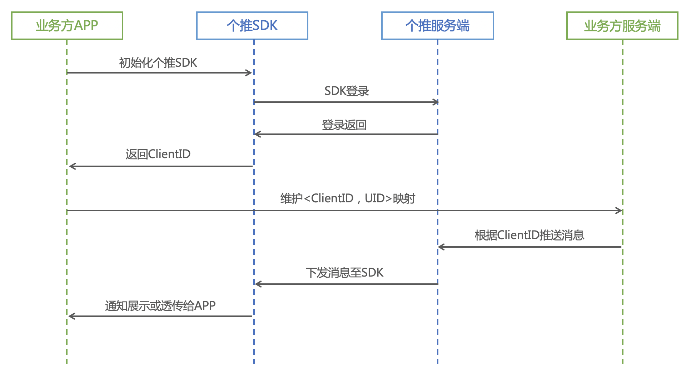
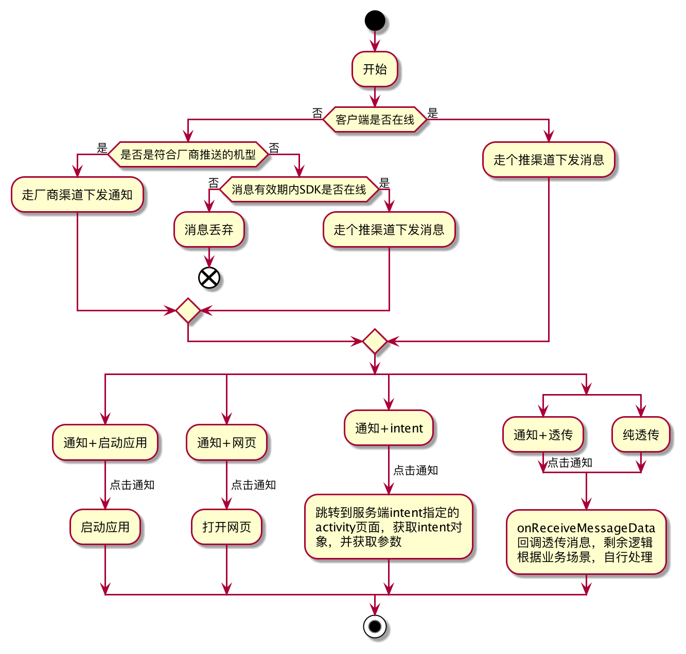

官方文档：https://docs.getui.com/getui/start/product/    
DCloud控制台：https://dev.dcloud.net.cn/uni/push

## 名词解释

### 消息形式
个推消息推送支持通知和透传两种形式。同时支持大图、大文本等富媒体展示，支持启动应用、打开第三方链接、打开应用内特定页面等后续操作等后续操作。

1、通知
指定通知标题和内容后，由个推SDK自动处理后、在系统通知栏中以通知栏消息的形式展示，同时响铃或震动提醒用户(响铃和震动受手机系统的设置状态影响)。

2、透传
即自定义消息，消息体格式客户可以自己定义，如纯文本、json串等。透传消息个推只传递数据，不做任何处理，客户端接收到透传消息后需要自己去做后续动作处理，如通知栏展示、弹框等。

### 推送目标
个推支持通过标签、别名、CID、用户分组四种方式来管理目标用户设置，开发者可根据自身业务需求灵活使用。

1、全部用户（All）  

即选择向APP的全体用户（所有已经安装该APP的用户）发送推送，通常适用于APP公告、更新升级等推送场景。

2、标签（Tag）

标签是用户的一种属性，用于描述用户的基础属性、兴趣爱好、行为特征等，在给某些用户设置某类标签后，就可以通过标签圈选具有共同特征的特定用户群，实现精准推送。比如给喜欢“足球”打上“足球”标签后，我们就可以通过圈选“足球”标签，给喜欢足球的用户，发送精准推送。

- 单个标签长度最大为32字节，单个ClientID标签总长度最大为512字节，单个ClientID最多设置100个标签。
- 两次调用标签接口的时间间隔需大于1s。
- 标签的设定支持除英文逗号和空格以外键盘上的所有字符。
- 标签的设定，一定要在获取到ClientID之后才可以设定。支持应用端和服务端调用接口实现标签的设定，设定成功后，可在个推开发者中心-配置管理-应用标签，查看应用的标签、导出各标签下的CID列表。
- 可在个推开发者中心-配置管理-应用标签，查看应用的标签、导出各标签下的CID列表。

3、别名（Alias）  

别名是APP为用户取的标识，该标识可以是APP业务层的用户标识，也可以是用户的昵称等。APP运营人员为用户绑定别名后，可以通过别名圈选目标用户组，方便APP运营同学快速、便捷地向特定的某群用户推送消息。

- 有效的别名组成：长度最长为40字节，支持中、英文（区分大小写）、数字、下划线。
- 服务端调用接口即可实现别名的绑定，一个CID只能绑定一个别名，重复绑定以最后一次为准，两次调用别名绑定接口的时间间隔需大于1s；一个别名最多可以绑定10个CID。
- 应用场景1：个推CID为32位，较长，运营同学发推送时不便获取、使用CID时，可通过别名圈选用户。
- 应用场景2：同一个设备上的同一个APP，只有1个CID，切换多个账号登陆时直接用CID发送推送，可能导致多个账号的推送信息串行，影响用户体验、泄露用户隐私；将账号设置为别名，并且切换账号时，需要解绑旧的账号，设置新的账号为别名，通过别名发送推送，就能确保收到推送的用户，即为当前登录的用户，避免消息串行。
- 应用场景3：同一个账号（比如手机号）分别登陆在 A、B、C 三台设备上的同一个 APP， 产生了 3 个不同的 CID, 想让这三台设备同时接收到推送，就可以考虑使用该接口，让三台设备的三个 CID都绑定同一个别名也就是你的账号（比如手机号），最多支持 10 台设备，也就是最多绑定 10 个 CID。

4、ClientID（简称CID）  

个推业务中的对外用户标识，用于标识客户端身份，由APP获取并保存到开发者服务端，是个推SDK的唯一标识。

5、用户分组  

用户可以事先通过个推提供的省市地区标签、用户属性标签或自己设定的应用标签，筛选出目标用户成立用户分组，在推送时直接选取某一用户分组作为推送目标，能够方便快捷地实现对特定用户群的推送。

...

更多名词可见个推：[名词解释](https://docs.getui.com/getui/more/word/)

## 推送流程

多厂商下发逻辑：

## 公共错误返回值

{"result":"sign_error"}sign鉴权失败
{"result":"AppidNoMatchAppKey"}	Appid和AppKey不匹配
{"result":"PushTotalNumOverLimit"}	推送总量超限
{"result":"TokenMD5NoUsers"}	cid没有查询到相关用户
{"result:"flow_exceeded"}	流控
{"result":"TooFrequent}	频控
{"result":"XXX is not null"}	参数校验失败
{"result:"AppidError"}	用户填写appId有误
{"result":"Text or Title Contain Sensitive Word Error: xx,xx"}	敏感词受限
{"result":"transmissionContent length overlimit"}	透传内容长度限制

参考：
https://github.com/GetuiLaboratory/getui-pushapi-java-demo/tree/master/src/main/java/com/getui/platform/demo （个推官方demo）   
https://docs.getui.com/ （首页-个推文档中心）     
https://vimsky.com/examples/detail/java-method-com.gexin.rp.sdk.http.IGtPush.pushMessageToApp.html
https://www.dtmao.cc/news_show_696670.shtml
https://blog.csdn.net/qq_39169713/article/details/110921416
