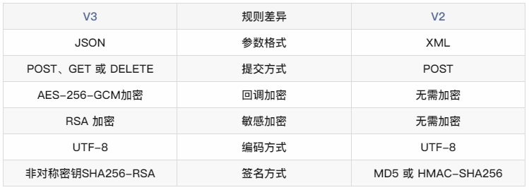
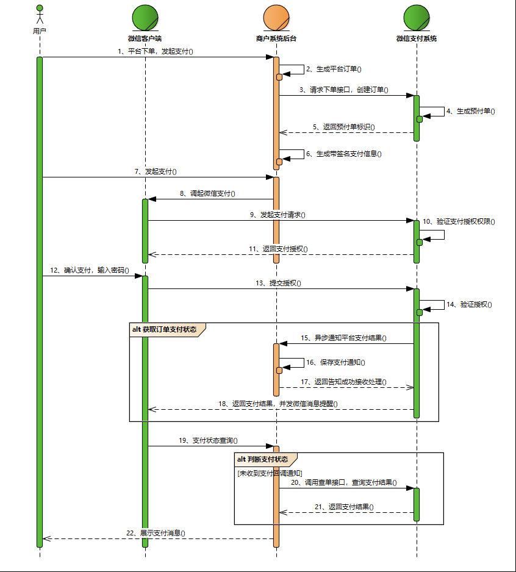
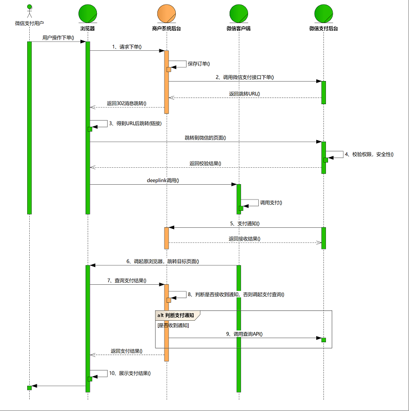
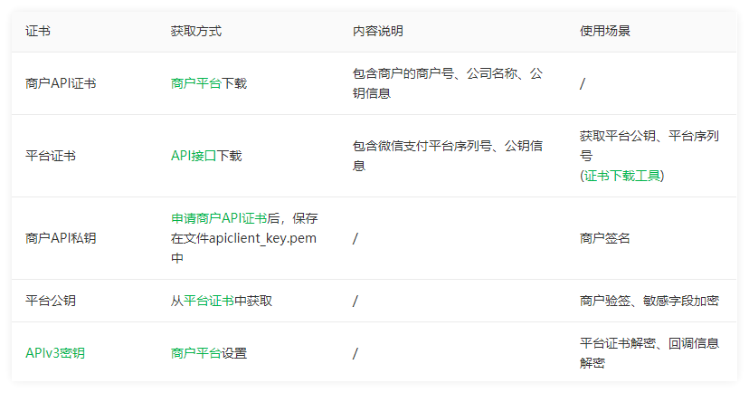

# 微信支付

V2与V3的差异：


## 名词解释

###  支付模式

#### 付款码支付

付款码支付是用户展示微信钱包内的“刷卡条码/二维码”给商户系统扫描后直接完成支付的模式。主要应用线下面对面收银的场景。

#### Native支付

Native支付是商户系统按微信支付协议生成支付二维码，用户再用微信“扫一扫”完成支付的模式。该模式适用于PC网站支付、实体店单品或订单支付、媒体广告支付等场景。

#### JSAPI支付

JSAPI支付是用户在微信中打开商户的H5页面，商户在H5页面通过调用微信支付提供的JSAPI接口调起微信支付模块完成支付。应用场景有：

- 用户在微信公众账号内进入商家公众号，打开某个主页面，完成支付
- 用户的好友在朋友圈、聊天窗口等分享商家页面链接，用户点击链接打开商家页面，完成支付
- 将商户页面转换成二维码，用户扫描二维码后在微信浏览器中打开页面后完成支付

#### APP支付

APP支付又称移动端支付，是商户通过在移动端应用APP中集成开放SDK调起微信支付模块完成支付的模式。

下是交互时序图，统一下单API、支付结果通知API和查询订单API等都涉及签名过程，调用都必须在商户服务器端完成。



商户系统和微信支付系统主要交互说明：

步骤1：用户在商户APP中选择商品，提交订单，选择微信支付。

步骤2：商户后台收到用户支付单，调用微信支付统一下单接口。参见【统一下单API】。

步骤3：统一下单接口返回正常的prepay_id，再按签名规范重新生成签名后，将数据传输给APP。参与签名的字段名为appid，partnerid，prepayid，noncestr，timestamp，package。注意：package的值格式为Sign=WXPay

步骤4：商户APP调起微信支付。api参见本章节【app端开发步骤说明】

步骤5：商户后台接收支付通知。api参见【支付结果通知API】

步骤6：商户后台查询支付结果。，api参见【查询订单API】（查单实现可参考：支付回调和查单实现指引）

#### H5支付

H5支付主要是在手机、ipad等移动设备中通过浏览器来唤起微信支付的支付产品。



#### 小程序支付

小程序支付是专门被定义使用在小程序中的支付产品。目前在小程序中能且只能使用小程序支付的方式来唤起微信支付


### 证书/秘钥/签名



#### 商户API证书

商户API证书是指由商户申请的，包含商户的商户号、公司名称、公钥信息的证书。

微信支付API v3使用由 证书授权机构 (Certificate Authority ，简称CA)签发颁发的证书。商户可自行生成证书请求串，或下载微信支付证书工具生成证书请求串，并将证书请求串提交到商户平台后才能获得商户API证书文件，私钥文件请注意安全保存。

作用：  
1、技术开发人员在调用微信支付安全级别较高的接口（如：退款、红包、付款）时，会使用到API证书。  
2、API证书是用来证实商户身份的， 证书中包含商户号、证书序列号、证书有效期等信息，需要由证书授权机构(Certificate Authority ，简称CA)签发，以防证书被伪造或篡改。


#### 商户API私钥

商户申请商户API证书时，会生成商户私钥，并保存在本地证书文件夹的文件apiclient_key.pem 中。私钥也可以通过工具从商户的p12证书中导出。请妥善保管好你的商户私钥文件。

#### 平台证书

商户平台证书是指由微信支付 负责申请的，包含微信支付平台标识、公钥信息的证书。商户可以使用平台证书中的公钥进行验签。
微信支付平台证书请调用["获取平台证书接口"](https://pay.weixin.qq.com/wiki/doc/apiv3/wechatpay/wechatpay5_1.shtml) 获取。

#### 证书序列号

证书序列号。每个证书都有一个由CA颁发的唯一编号，即证书序列号。如何查看证书序列号请看这里。

#### API V3秘钥

API v3密钥。为了保证安全性，微信支付在回调通知和平台证书下载接口中，对关键信息进行了AES-256-GCM加密。API v3密钥是加密时使用的对称密钥。商户可以在【商户平台】->【API安全】的页面设置该密钥。

参考：https://kf.qq.com/faq/161222NneAJf161222U7fARv.html


## 环境准备

### API 密钥设置     
请登录商户平台进入【账户中心】->【账户设置】->【API安全】->【APIv3密钥】中设置 API 密钥。   
   具体操作步骤请参见：[什么是APIv3密钥？如何设置？ ](https://kf.qq.com/faq/180830E36vyQ180830AZFZvu.html) 
   

### 获取 API 证书    
请登录商户平台进入【账户中心】->【账户设置】->【API安全】根据提示指引下载证书。   
   具体操作步骤请参见：[什么是API证书？如何获取API证书？](https://kf.qq.com/faq/161222NneAJf161222U7fARv.html)
    
按照以上步骤操作后你将获取如下内容：

- apiKey API 密钥
- apiKey3 APIv3 密钥
- mchId 商户号
- apiclient_key.pem X.509 标准证书的密钥
- apiclient_cert.p12 X.509 标准的证书+密钥
- apiclient_cert.pem X.509 标准的证书

### 请求签名
如何生成签名参数？[官方文档](https://wechatpay-api.gitbook.io/wechatpay-api-v3/qian-ming-zhi-nan-1/qian-ming-sheng-cheng) 描述得非常清楚这里就不啰嗦了。

示例代码：

1、构造签名串
```java
    /**
	 * 构造签名串
	 *
	 * @param method    {@link RequestMethod} GET,POST,PUT等
	 * @param url       请求接口 /v3/certificates
	 * @param timestamp 获取发起请求时的系统当前时间戳
	 * @param nonceStr  随机字符串
	 * @param body      请求报文主体
	 * @return 待签名字符串
	 */
	public static String buildSignMessage(RequestMethod method, String url, long timestamp, String nonceStr, String body) {
		return new StringBuilder()
			.append(method.toString())
			.append("\n")
			.append(url)
			.append("\n")
			.append(timestamp)
			.append("\n")
			.append(nonceStr)
			.append("\n")
			.append(body)
			.append("\n")
			.toString();
	}
```

2、构造 HTTP 头中的 Authorization
```java
    /**
	 * 构建 v3 接口所需的 Authorization
	 *
	 * @param method    {@link RequestMethod} 请求方法
	 * @param urlSuffix 可通过 WxApiType 来获取，URL挂载参数需要自行拼接
	 * @param mchId     商户Id
	 * @param serialNo  商户 API 证书序列号
	 * @param keyPath   key.pem 证书路径
	 * @param body      接口请求参数
	 * @param nonceStr  随机字符库
	 * @param timestamp 时间戳
	 * @param authType  认证类型
	 * @return {@link String} 返回 v3 所需的 Authorization
	 * @throws Exception 异常信息
	 */
	public static String buildAuthorization(RequestMethod method, String urlSuffix, String mchId,
											String serialNo, String keyPath, String body, String nonceStr,
											long timestamp, String authType) throws Exception {
		// 构建签名参数
		String buildSignMessage = PayKit.buildSignMessage(method, urlSuffix, timestamp, nonceStr, body);
		// 获取商户私钥
		String key = PayKit.getPrivateKey(keyPath);
		// 生成签名
		String signature = RsaKit.encryptByPrivateKey(buildSignMessage, key);
		// 根据平台规则生成请求头 authorization
		return PayKit.getAuthorization(mchId, serialNo, nonceStr, String.valueOf(timestamp), signature, authType);
	}
	
	/**
	 * 获取授权认证信息
	 *
	 * @param mchId     商户号
	 * @param serialNo  商户API证书序列号
	 * @param nonceStr  请求随机串
	 * @param timestamp 时间戳
	 * @param signature 签名值
	 * @param authType  认证类型，目前为WECHATPAY2-SHA256-RSA2048
	 * @return 请求头 Authorization
	 */
	public static String getAuthorization(String mchId, String serialNo, String nonceStr, String timestamp, String signature, String authType) {
		Map<String, String> params = new HashMap<>(5);
		params.put("mchid", mchId);
		params.put("serial_no", serialNo);
		params.put("nonce_str", nonceStr);
		params.put("timestamp", timestamp);
		params.put("signature", signature);
		return authType.concat(" ").concat(createLinkString(params, ",", false, true));
	}
```

3、拼接参数
```java
public static String createLinkString(Map<String, String> params, String connStr, boolean encode, boolean quotes) {
		List<String> keys = new ArrayList<String>(params.keySet());
		Collections.sort(keys);
		StringBuilder content = new StringBuilder();
		for (int i = 0; i < keys.size(); i++) {
			String key = keys.get(i);
			String value = params.get(key);
			// 拼接时，不包括最后一个&字符
			if (i == keys.size() - 1) {
				if (quotes) {
					content.append(key).append("=").append('"').append(encode ? urlEncode(value) : value).append('"');
				} else {
					content.append(key).append("=").append(encode ? urlEncode(value) : value);
				}
			} else {
				if (quotes) {
					content.append(key).append("=").append('"').append(encode ? urlEncode(value) : value).append('"').append(connStr);
				} else {
					content.append(key).append("=").append(encode ? urlEncode(value) : value).append(connStr);
				}
			}
		}
		return content.toString();
	}
```
从上面示例来看我们还差两个参数

- serial_no 证书序列号
- signature 使用商户私钥对待签名串进行 SHA256 with RSA 签名


来自：     
[微信支付开发文档](https://github.com/Wechat-Group/WxJava/wiki/%E5%BE%AE%E4%BF%A1%E6%94%AF%E4%BB%98%E5%BC%80%E5%8F%91%E6%96%87%E6%A1%A3)
https://pay.weixin.qq.com/wiki/doc/api/index.html （V2文档）
https://pay.weixin.qq.com/wiki/doc/apiv3/open/pay/chapter2_5_3.shtml(V3文档)
https://developers.weixin.qq.com/community/develop/article/doc/000cca8440c6a0dca61a3efb053c13 （V3接口规则）
https://developers.weixin.qq.com/community/develop/article/doc/00068ab2a8c6006ba28baeb745b413 （V3版java整合）
https://github.com/Wechat-Group/WxJava (WxJava第三方库)
https://github.com/binarywang/weixin-java-pay-demo (WxJava库demo)
https://gitee.com/52itstyle/spring-boot-pay/tree/master (spring-boot-pay 聚合支付宝、微信等支付demo)
https://javen205.gitee.io/ijpay/guide/config/weixinpay_config.html (ijpay-整合了支付宝、微信等常见支付方式)

## 问题总结

1、商家参数格式有误，请联系商家解决

在做微信H5支付的时候难免会遇到这个问题，一般最常见的问题是请求头没有设置Referer这个参数或Referer参数域名与微信那边设置的安全域名不一致导致的。在这里只讲前者的解决方法，后者自行咨询微信那边处理。

https://www.cnblogs.com/MingGyGy-Castle/p/14047286.html

2、微信H5支付提示“商家存在未配置的参数，请联系商家解决”

- 在微信商户平台配置了H5支付域名
- 当前调起H5支付的域名和微信商户后台配置的一样，如下
- redirect_url的参数的域名也和微信商户平台配置的一样

3、微信h5支付请求已失效，请重新发起支付

考虑两种情况：
- 支付链接过期，默认为5分钟
- 发起支付的链接有误，比如 prepay_id 为空。建议打开前台控制台查看。

发起h5支付的标准连接为：https://wx.tenpay.com/cgi-bin/mmpayweb-bin/checkmweb?prepay_id=wx09120139422596c14d16da764127cb0000&package=2478160546

带跳转的支付链接为：https://wx.tenpay.com/cgi-bin/mmpayweb-bin/checkmweb?prepay_id=wx09120139422596c14d16da764127cb0000&package=2478160546&redirect_url=http%3A%2F%2Fowner.smart.tbzhsq.com%2F%23%2FpaymentMethod

# 支付宝支付

## 生成秘钥

###  普通公钥与公钥证书区别

企业开发者若涉及 [资金类支出接口](https://opendocs.alipay.com/open/291/hfaalq) 接入，必须使用 公钥证书 方式。

个人开发者不涉及到资金类接口，建议使用 公钥方式 进行加签。

在报文签名场景下，报文接收方使用发送方的公钥进行报文验签，该功能两种签名方式都可以实现。

公钥证书签名方式引入了 CA 机构对公钥持有者进行身份识别，保证该证书所属实体的真实性，以实现报文的抗抵赖。

公钥证书签名方式下，开放平台支持通过上传 CSR 文件的方式给开发者在线签发应用公钥证书，新的开放平台 RSA 验签和签名工具支持生成 CSR 文件。


参考：   

https://pay.weixin.qq.com/wiki/doc/api/H5.php?chapter=15_4 (error message ref)
https://opendocs.alipay.com/open/291/105971 （ali支付开发工具）
https://opendocs.alipay.com/open/203/105288 （ali支付能力）
https://opendocs.alipay.com/apis/api_1/alipay.trade.pay（ali支付API接口）
https://blog.csdn.net/wzy18210825916/article/details/108451321 （快速例子）
https://opendocs.alipay.com/open/200/105311  (沙箱环境使用)
https://openhome.alipay.com/platform/appDaily.htm?tab=account （沙箱环境配置）